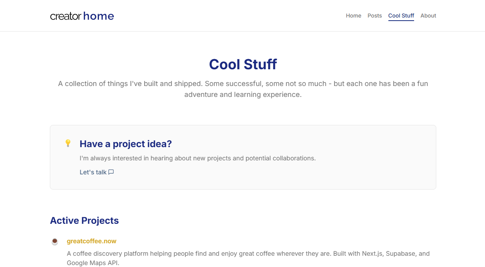

# Creator Home

A modern, animated personal website template for creators who build and ship software products. Built with Astro, Shadcn UI, and TailwindCSS.


## ✨ Features

- **Lightning Fast**: Built with Astro for exceptional performance
- **Beautiful Animations**: Subtle fade-ups and bounces that bring your content to life
- **Fully Responsive**: Looks great on all devices
- **Component-Based**: Built with reusable components using Shadcn UI
- **Post Integration**: Ready to connect with your Hashnode and list your posts
- **Showcase your work**: Minimalistic cards to tell about the cool stuff you've made
- **Newsletter Ready**: Built-in newsletter subscription system

<div align="center">
  
  
</div>

## Responsive Design

<div align="center">
  
  
  
</div>

## Hashnode Integration

This website comes with built-in integration for your Hashnode newsletter. All you need is three keys from your Hashnode account to get started.

### What's Included
- **Blog Posts**: Automatically displays your Hashnode blog posts
- **Newsletter**: Lets visitors subscribe to your Hashnode newsletter
- **Error Handling**: Friendly error messages if something goes wrong
- **Loading States**: Nice loading animations while content is being fetched

## Quick Start

1. Clone this repository and install dependencies:
```bash
git clone https://github.com/yourusername/creator-home.git
cd creator-home
npm install
```

2. Create a `.env.local` file in the project root and add your Hashnode credentials:
```env
# Hashnode Posts Configuration
PUBLIC_HASHNODE_HOST="your-blog.hashnode.dev"

# Newsletter Signup Configuration
PUBLIC_HASHNODE_PUBLICATION_ID="your_publication_id"
HASHNODE_ACCESS_TOKEN="your_personal_access_token"
```

    How to get your keys from Hashnode:

    - Log into your Hashnode account
    - Go to Account Settings → Developer Settings
    - Copy your Publication ID and Access Token
    - For the Host, use your Hashnode blog URL without 'https://' (e.g., "johndoe.hashnode.dev")
    - Paste them into the `.env.local` file

    That's it! Your blog posts and newsletter will now work automatically. No coding required.

    Note: Keep your Access Token private - don't share it or commit it to public repositories.

3. Customize the site by editing:
   - `src/pages/index.astro` - Your home page content, newsletter name, and current projects
   - `src/pages/about.astro` - Your personal journey and background
   - `src/pages/projects.astro` - Your project showcase
   - `src/pages/posts.astro` - Your newsletter posts and layout
   - `src/components/Navbar.astro` - Your logo and navigation links
   - `src/components/Footer.astro` - Your social media links
   - `public/images` - Your images and assets

4. Start the development server:
```bash
npm run dev
```

    http://localhost:4321/

5. Build your production site to `./dist/`:
```bash
npm run build
```

6. Preview your build locally, before deploying:
```bash
npm run preview
```

7. Deploy
```bash
Deploy the `dist` folder to your preferred hosting platform (Vercel, Netlify, etc.)
```

Created with ❤️ by [Henrik Jorgensen](https://github.com/henrik-jorgensen)
